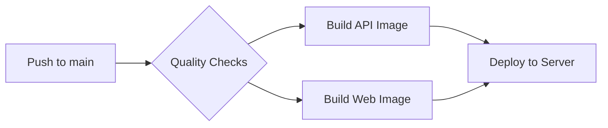

# مـفـصـل | MUFASAL

**Premium Tailoring & Fabric Marketplace** — Hyper-scalable SaaS ERP with Omni-AI.

> منصة متكاملة للخياطة الراقية وبيع الأقمشة، تدعم العملاء، محلات الخياطة، تجار الأقمشة، والإدارة.

---

## 🏗️ Architecture

```
┌─────────────────────────────────────────────────────┐
│                   Nginx (Reverse Proxy)              │
│          mufasal.com ← → localhost:80/443            │
└────────────────────┬────────────────────────────────┘
                     │
        ┌────────────┴────────────┐
        │                         │
   ┌────▼─────┐            ┌─────▼──────┐
   │  Next.js  │            │  Express   │
   │  Frontend │◄──────────►│  API       │
   │  :3000    │            │  :4001     │
   └───────────┘            └─────┬──────┘
                                  │
                    ┌─────────────┼─────────────┐
                    │             │             │
               ┌────▼───┐   ┌────▼───┐   ┌────▼────┐
               │PostgreSQL│  │ Redis  │   │ BullMQ  │
               └─────────┘   └────────┘   └─────────┘
```

### Stack
| Component | Technology | Purpose |
|-----------|-----------|---------|
| **Frontend** | Next.js 14 (React, TypeScript) | Tailwind CSS, RTL Arabic-first |
| **Backend** | Express.js (TypeScript) | REST API + Socket.IO |
| **Database** | PostgreSQL 16 (via Prisma ORM) | 40+ models, relational |
| **Cache** | Redis 7 (with in-memory fallback) | Sessions, rate limiting, BullMQ |
| **Queues** | BullMQ | Async AI & notification tasks |
| **AI** | Google Gemini / OpenAI / DeepSeek | Factory pattern, no vendor lock-in |
| **Proxy** | Nginx | SSL, rate limiting, caching, WebSocket |

---

## 🚀 Quick Start

### Prerequisites
- Node.js ≥ 18
- PostgreSQL 16 (running locally or via Docker)
- npm

### 1. Clone & Install
```bash
git clone <repo> mufasal
cd mufasal

# Install dependencies (via temp dir to avoid OneDrive issues on Windows)
services\api\npm install
apps\web\npm install
```

### 2. Configure Environment
```bash
cp .env.example .env
# Edit .env with your database credentials
```

### 3. Database Setup
```bash
# Push schema to database
cd services/api
npx prisma db push
npx prisma db seed     # Seeds: 3 shops, 10 products, 2 users

# Or use migrations (for production)
npx prisma migrate deploy
```

### 4. Start Development
```bash
# Option A: Start both servers (from project root)
npm run dev

# Option B: Start individually
cd services/api && npm run dev    # → http://localhost:4001
cd apps/web && npm run dev        # → http://localhost:3000

# Option C: Windows OneDrive workaround
start-dev.bat
```

### Default Credentials
| Role | Email | Password |
|------|-------|----------|
| Admin | admin@mufasal.com | admin123 |
| Customer | customer@mufasal.com | admin123 |
| Rep | rep@mufasal.com | admin123 |
| Tailor | tailor@mufasal.com | admin123 |
| Merchant | merchant@mufasal.com | admin123 |

---

## 🐳 Docker Production

```bash
# Build & start all services
docker compose -f docker-compose.yml -f docker-compose.prod.yml up -d

# First-time database setup
docker compose run --rm api npx prisma migrate deploy
docker compose run --rm api npx prisma db seed

# View logs
docker compose logs -f

# Stop
docker compose down
```

### Production URLs
| Service | URL |
|---------|-----|
| Web App | https://mufasal.onrender.com |
| API | https://mufasal-api.onrender.com/api/v1 |
| API Health | https://mufasal-api.onrender.com/api/health |
| WebSocket | wss://mufasal-api.onrender.com |

---

## 📡 API Overview

Base URL: `http://localhost:4001/api/v1`

| Endpoint | Description |
|----------|-------------|
| `POST /auth/login` | Login (email or phone) |
| `POST /auth/register` | Register new user |
| `GET /products` | List products |
| `GET /shops` | List shops (with geolocation) |
| `GET /orders` | List orders |
| `GET /notifications` | User notifications |
| `POST /payments/process` | Process payment (8 gateways) |
| `POST /payments/invoice/:id` | Generate ZATCA invoice |
| `GET /delivery/order/:id` | Get delivery status |
| `POST /reviews` | Create review (after order complete) |
| `GET /admin/dashboard` | Dashboard stats |
| `GET /admin/reports/*` | Revenue, orders, shops reports |

---

## 🧩 Key Features

### 👔 4 User Interfaces
1. **Customer** — Browse shops, order tailoring, track delivery, reviews
2. **Tailor Shop** — Manage orders, staff, products, measurements
3. **Fabric Merchant** — B2B fabric catalog, inventory, bulk pricing
4. **Admin** — Dashboard, users, configs, modules, reports, audit logs

### 💳 8 Payment Gateways
Mada • Visa/Mastercard • Apple Pay • STC Pay • Tamara • Tabby • Sadad • Cash

### 🚚 6 Delivery Providers
Shop Vehicle • Uber • Careen • Jeeny • SMSA • Aramex

### 📄 ZATCA E-Invoicing
Phase 1 & 2 compliant: generation, signing, reporting, clearance, QR codes

### 🤖 Omni-AI
- AI Factory pattern: Gemini, OpenAI, DeepSeek
- Behavioral learning from user actions
- BullMQ queue for heavy AI tasks
- Redis caching for AI responses

### 🔒 Security
- JWT (access + refresh tokens)
- Role-based access (hierarchical)
- Rate limiting (API, auth, general)
- CORS, Helmet headers (in production via Nginx)
- CSP, HSTS, XSS protection

---

## 📁 Project Structure

```
mufasal/
├── apps/
│   └── web/                    # Next.js frontend
│       └── src/
│           ├── app/            # Pages (60+ route files)
│           ├── components/     # Reusable UI & shared components
│           └── lib/            # API client, hooks, stores, utils
├── services/
│   └── api/                    # Express backend
│       └── src/
│           ├── config/         # App configuration
│           ├── controllers/    # Route handlers (14 controllers)
│           ├── middleware/     # Auth, validation, upload
│           ├── routes/         # Express routers (14 route files)
│           ├── services/       # Business logic (20+ services)
│           │   ├── delivery/   # 6 delivery providers
│           │   ├── payment/    # 8 payment gateways
│           │   └── zATCA/      # ZATCA e-invoicing
│           └── utils/          # Logger, response helpers
├── packages/
│   ├── shared/                 # Shared types & constants
│   └── ui/                     # Shared UI components
├── docker/                     # Dockerfiles & Nginx config
├── scripts/                    # Deployment scripts
└── .github/workflows/          # CI/CD pipeline
```

---

## 🛠️ Tech Stack Details

### Frontend Dependencies
- **next** 14.2 — React framework with App Router
- **tailwindcss** — Utility-first CSS
- **zustand** — State management
- **react-hot-toast** — Notifications
- **date-fns** — Date formatting
- **recharts** — Charts & analytics

### Backend Dependencies
- **express** 4.18 — HTTP server
- **@prisma/client** 5.22 — Database ORM
- **socket.io** 4.7 — Real-time WebSocket
- **ioredis** 5.3 — Redis client
- **bullmq** 5.20 — Job queues
- **jsonwebtoken** — JWT auth
- **bcryptjs** — Password hashing
- **zod** — Request validation
- **multer** — File uploads
- **sharp** — Image processing
- **winston** — Logging
- **qrcode** — ZATCA QR generation
- **firebase-admin** — Push notifications
- **twilio** — SMS
- **nodemailer** — Email
- **@google/generative-ai** — Gemini AI
- **openai** — OpenAI integration

---

## ⚙️ Configuration

All configuration via environment variables. Key variables:

| Variable | Default | Description |
|----------|---------|-------------|
| `DATABASE_URL` | — | PostgreSQL connection string |
| `REDIS_URL` | `redis://localhost:6379` | Redis connection |
| `JWT_SECRET` | — | JWT signing key (min 32 chars) |
| `JWT_REFRESH_SECRET` | — | Refresh token key |
| `PORT` | `4001` | API server port |
| `NODE_ENV` | `development` | Environment |
| `CORS_ORIGINS` | `http://localhost:3000` | Allowed origins |

Full list in `.env.example` and `.env.production`.

---

## 📊 Database Schema

40 tables across 10 domains:
1. **Shop & Users** — Shop, User, Role, Integration
2. **HR & AI** — UserBehaviorLog, AIProfile
3. **Products & Inventory** — Category, Product, ProductVariant, InventoryMovement
4. **Shop Services** — ShopService, ShopVehicle, ServiceRequest
5. **Orders & Reviews** — Order, OrderItem, Customer, Review
6. **Delivery** — DeliveryRequest, DeliveryTracking
7. **Payments** — PaymentTransaction
8. **Invoicing & Manufacturing** — Invoice, ManufacturingOrder, ManufacturingTask
9. **Accounting** — Account, JournalEntry, JournalLine
10. **System** — Notification, UserAddress, UserMeasurement, OrderMeasurement, ConfirmationLink, Conversation, Message, AuditLog, SystemConfig, SystemModule, DeviceToken

Every table indexed on query paths. See `services/api/prisma/schema.prisma`.

---

## 🧪 Testing

```bash
# Backend tests
cd services/api && npm test

# Lint & typecheck
npm run lint
npm run typecheck
```

---

## 🚢 CI/CD Pipeline



See `.github/workflows/deploy.yml`.

---

## 📝 License

Private — MUFASAL © 2026

---

## 🤝 Support

- Email: itbinniser@gmail.com
- Issues: GitHub Issues
